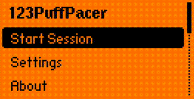

# 123PuffPacer — Flipper Zero Puff Timer for IQOS, HEETS, TEREA, Lil Solid, glo, and Ploom

123PuffPacer is a Flipper Zero puff timer and heated tobacco session timer for IQOS, IQOS ILUMA, HEETS, TEREA, Lil Solid, glo, Ploom, and similar heat-not-burn devices. It helps you pace your puffs evenly throughout a session with vibration and sound alerts.

## Why Use 123PuffPacer?

Heated tobacco sticks have a limited number of puffs and a fixed session time. If you puff too fast, you waste the stick. 123PuffPacer divides your session into equal intervals and alerts you when it's time for the next puff, so you get more consistent pacing from start to finish.

If you are looking for an IQOS timer, HEETS timer, TEREA timer, or a Flipper Zero heated tobacco timer, this app is built for that exact use case.

## Best For

- **IQOS / IQOS ILUMA** session pacing
- **HEETS / TEREA** stick timing
- **Lil Solid, glo, and Ploom** heat-not-burn sessions
- **Flipper Zero users** who want a simple interval-based puff timer

## Features

- **Configurable puff count** — 8 to 20 puffs per session (default: 10)
- **Configurable interval** — 10 to 40 seconds between puffs (default: 30s)
- **Vibration control** — Off / Short / Long
- **Sound control** — Off / On
- **Smoke animation** — procedural smoke wisps on each puff for 5 seconds
- **Live session screen** — puff counter, countdown timer, elapsed time, progress bar
- **Statistics dashboard** — started/completed counters and session log
- **Session history log** — date + time + session parameters (puffs, interval)
- **Daily graph (7 days)** — bar chart with per-day counts and day selection
- **Hourly drill-down** — select a day and open per-hour chart for that date
- **Safe reset statistics** — confirmation dialog before clearing stats
- **Pause/resume** with OK button
- **Reset settings** — one-click reset to defaults
- **Persistent settings** — saved to SD card, remembered between launches
- **Backlight stays on** during active session
- **About screen** with version info and links

## Demo



## Screenshots

```
┌────────────────────────────┐   ┌────────────────────────────┐
│      123PuffPacer          │   │ Puff Count          < 10 > │
│                            │   │ Interval            < 30s >│
│  > Start Session           │   │ Vibration         < Short >│
│    Settings                │   │ Sound                < On >│
│    Statistics              │   │ Reset Settings              │
│    About                   │   │ Reset Statistics            │
│                            │   │                            │
└────────────────────────────┘   └────────────────────────────┘
         Main Menu                         Settings

┌────────────────────────────┐   ┌────────────────────────────┐
│ 123PuffPacer       00:03   │   │                            │
│ ~                      ~ ~ │   │                            │
│  ~    Puff 1 / 10    ~     │   │         Session            │
│   ~   Next in: 27s    ~    │   │        Complete!            │
│ ~                      ~   │   │                            │
│    [░░░░░░░░░░░░░░░]       │   │           [OK]              │
│ [OK]=Pause    [<]=Exit     │   │                            │
└────────────────────────────┘   └────────────────────────────┘
    Session (with smoke)                 Done Screen
```

### Statistics Screens

```
┌────────────────────────────┐   ┌────────────────────────────┐
│ Statistics       S:12 D:10 │   │  1 0 2 1 1 3 2            │
│ Log 1-3/10                 │   │ ┌────────────────────────┐ │
│ 06.03 10:41 10x30          │   │ │      █     █          │ │
│ 06.03 09:58 10x30          │   │ │  █   █   █ █   █      │ │
│ 05.03 23:17 10x30          │   │ │█ █ █ █ █ █ █ █ █      │ │
│                            │   │ └────────────────────────┘ │
│ OK Graph        [<] Back   │   │ OK Hours  Daily   [<] List │
└────────────────────────────┘   └────────────────────────────┘
      Statistics List                  Daily Graph (7 days)

┌────────────────────────────┐
│      06.03 by hour         │
│ ┌────────────────────────┐ │
│ │██  ██ █ ███ ████  █    │ │
│ │█   █  █ █ █ █  █  █    │ │
│ └────────────────────────┘ │
│ 0   4   8  12  16  20  23 │
│ [<] Days   Hourly  Count:6 │
└────────────────────────────┘
     Hourly Graph (selected day)
```

## Supported Heat-Not-Burn Devices

Works with popular heated tobacco and heat-not-burn devices:

- **IQOS** — ILUMA, ILUMA Prime, ILUMA One, DUO, 3
- **Lil** — Solid 3.0, Solid 2.0, Solid EZ, Hybrid 2.0
- **glo** — Hyper X2, Hyper+, Pro, Nano
- **Ploom** — X Advanced, X, S
- **Jouz** — 20, 20S, 12
- And similar heated tobacco devices with fixed session timing

## Install

### From .fap file

1. Download `puff_pacer.fap` from [Releases](../../releases)
2. Copy to your Flipper Zero SD card: `SD Card/apps/Tools/`
3. Open on Flipper: `Applications → Tools → 123PuffPacer`

### Build from source

```bash
# Install ufbt if you haven't
pip install ufbt

# Clone and build
git clone https://github.com/123fzero/123PuffPacer.git
cd 123PuffPacer
ufbt

# Build and launch on connected Flipper
ufbt launch
```

## Usage

1. Open 123PuffPacer from Applications → Tools
2. (Optional) Go to **Settings** to adjust puff count, interval, vibration, and sound
3. Select **Start Session**
4. Flipper alerts you on each interval — take a puff!
5. Press **OK** to pause/resume, **Back** to exit
6. Use **Statistics** to view log entries and daily/hourly charts
7. After all puffs — "Session Complete!" screen

## Controls

| Button | Action |
|--------|--------|
| OK | Start session / Pause / Resume |
| Back | Go back / Exit session |
| Left/Right | Change settings values |

### Statistics Controls

| Button | Action |
|--------|--------|
| OK (in list) | Open daily graph |
| Left/Right (daily graph) | Select day column |
| OK (daily graph) | Open hourly graph for selected day |
| Back (hourly graph) | Return to daily graph |
| Back (daily graph) | Return to statistics list |

## Tested On

- **Firmware:** Momentum (mntm-012)
- **API:** 87.1
- **Hardware:** Flipper Zero (f7)

Should also work on official firmware and other custom firmwares (Unleashed, RogueMaster, Xtreme) with compatible API versions.

## License

MIT
